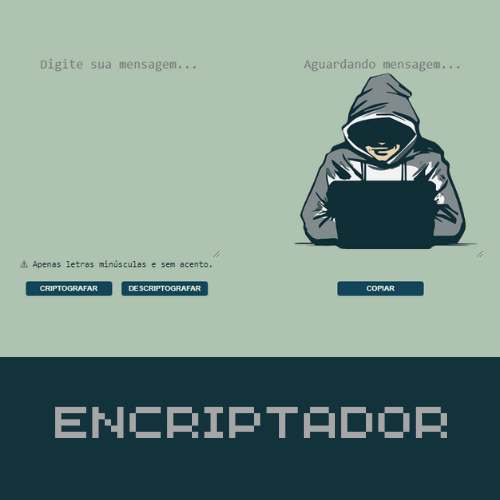

# ENCRIPTADOR



### Ajustes e melhorias

Este foi o meu primeiro projeto de autoria própria, foi desenvolvido com os conhecimentos que obtive no início dos meus estudos e logo após um tempo, pude aplicar melhorias ao código.

## ☕ Usando  o Encriptador

Para usar o Encriptador, siga estes passos:

```
1º No primeiro campo digite a mensagem que deseja criptografar/descriptografar; 
2º Clique no botão correspondente a função desejada;
3º A mensagem aparecerá no segundo campo, onde é possivel copiá-la apenas com um clique.

```

## 🤝 Colaboradores

<table>
  <tr>
    <td align="center">
      <a href="#">
        <br>
        <sub>
          <b>Matheus Silva</b>
        </sub>
      </a>
    </td>
  </tr>
</table>

## 📝 Licença

Esse projeto está sob licença. Veja o arquivo [LICENÇA](LICENSE.md) para mais detalhes.

[⬆ Voltar ao topo](#Encriptador)<br>
